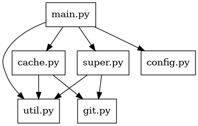

# subpatch: internal README file

## subpatch's wobsite

This is the source of the website [subpatch.net](https://subpatch.net).
It's generate with [mkdocs](https://www.mkdocs.org/) and uses the
[material theme](https://squidfunk.github.io/mkdocs-material/).

How to test locally:

    $ mkdocs serve

How to deploy:

    $ mkdocs gh-deploy

### Conventions

The term 'subpatch' is always spelled lowercase. Even at the start of sentence.

## How to develop?

Useful makefile targets

    $ make tests
    $ make lint

The project is adopting `ruff` as a python linter and checker. Currently only a
very limited set of rules is enabled, but this should change in the future:

    $ ruff check subpatch.py
    $ ruff check subpatch.py --fix  # ruff can also fix directly

Note: Use `make lint` to also check the python code in the folder `tests/`.

The codebase also starts to use type annotations. Check these with

    $ mypy src/*.py

But it's not yet type error free.

The codebase uses unit and integration tests extensively. To execute a single
tests

    $ python3 tests/test_prog.py TestNoCommands.test_version
    $ tests/test_prog.py TestNoCommands.test_version

Tips: If a test fails, e.g., because of a difference in the console output, you can use

    $ DEBUG=1 tests/test_prog.py TestNoCommands.test_version

to print stdout and stderr of the subpatch invocation to the console for
further inspection.

## Source file structure

The source files are in the folder [src](src/). The include graph is:

For testing and distribution the files are bundled together to a single
`subpatch.py`.

The tests are in the folder [tests](tests/).

## How to release

*Note*: This section has still some rough edges.

First all tests should be green:

    $ make tests

Second the necessary tools must be installed:

    $ sudo apt-get install python3-build twine

Increase version number, create commit and tag. Replace `X` with the current
version number.

    $ vim subpatch
    $ git add -p subpatch
    $ git commit -m "Release version v0.1aX"
    $ git show  # check
    $ git tag -m "subpatch version v0.1aX" v0.1aX
    $ git show v0.1aX  # check
    $ git describe     # check

Build release

    # TODO Rework section for new pybundle.py script
    # TODO Check for changes in pyproject.toml
    $ make dist

Test installation locally

    $ pipx install dist/subpatch-*.whl
    $ subpatch --version
    # make some tests "status" and "add" command

    # Remove it for later install with testpypi
    $ pipx uninstall subpatch

There is some issue with `twine` for now. I get the error

    $ twine upload --repository testpypi dist/*
    Uploading distributions to https://test.pypi.org/legacy/
    ERROR    InvalidDistribution: Metadata is missing required fields: Name, Version.
             Make sure the distribution includes the files where those fields
             are specified, and is using a supported Metadata-Version: 1.0,
             1.1, 1.2, 2.0,  2.1, 2.2.
    $ twine --version
    twine version 5.0.0 (importlib-metadata: 4.12.0, keyring: 24.3.1, pkginfo:
    1.9.6, requests: 2.31.0, requests-toolbelt: 1.0.0, urllib3: 2.0.7)

My current solution, using twine in a venv. That has a newer version:

    $ python3 -m venv env
    $ . env/bin/activate
    $ pip install twine
    $ twine --version
    twine version 6.1.0 (keyring: 25.6.0, packaging: 25.0, requests: 2.32.4, requests-toolbelt: 1.0.0, urllib3: 2.5.0, id: 1.5.0)

Publish release on testpypi website

    $ . env/bin/activate
    # TODO ensure API token in ~/.pypirc
    $ twine upload --repository testpypi dist/*
    # Check website
    #   https://test.pypi.org/project/subpatch/

Make test install from test pypi

    $ pipx install -i https://test.pypi.org/simple/ subpatch

    # make some tests
    $ subpatch --version

    $ pipx uninstall subpatch

Publish release commit and tag

    $ git push origin main --follow-tags --dry-run
    To github.com:lengfeld/subpatch.git
       479f2d4..9ed50ba  main -> main
     * [new tag]         v0.1a2 -> v0.1a2
    $ git push origin main --follow-tags

    # Check tag website on github
    https://github.com/lengfeld/subpatch/tags

Make release to real pypi

    $ twine upload dist/*
    # visit website
    #    https://pypi.org/project/subpatch/

    # Install with pipx
    $ pipx install subpatch

    # Check with
    $ subpatch --version

Publish release on website:

    $ cp subpatch website/downloads/latest/subpatch
    $ mkdir website/downloads/v0.1aX
    $ cp subpatch website/downloads/v0.1aX/subpatch
    $ vim website/ref/releases.md   # write release notes and changelog
    $ git add website/downloads/ website/ref/releases.md
    $ git diff --cached
    $ git commit -m "add v0.1aX release to website"
    $ mkdocs serve
    $ git push origin main --dry-run
    $ git push origin main
    $ mkdocs gh-deploy

Make release on github:

* Goto https://github.com/lengfeld/subpatch/releases
* Create release
* Title `subpatch version v0.1aX`
* Add text:

      See the [release notes webpage](https://subpatch.net/ref/releases/#v01aX)

* Mark as pre-release

Should look like the other releases.

## Code style

Not much conventions yet. For naming in python stick to the
[Google Python Style Guide - Naming](https://google.github.io/styleguide/pyguide.html#316-naming).

## TODOs and ideas

Allow to lock subprojects. The CI check should error/warn, when a PR/commit
introduces changes to a subproject dir!
If a subroject is not locked, the CI would also error/warn and request the
contributer to execute a command to create a patch file!

Write test that
  $ git config -f .subpatch  subpatch."external/repo".url
works and add documentation.
This was found while reading some "git submodules" docu

Provide script to convert a
* kas
* git submodule (support recursion)
* repo
superproject to subpatch

Watch stackoverflow and respone to questions. (When the software is live.)

Text gui frontend for the layer index
(https://layers.openembedded.org/layerindex/branch/master/layers/)
to easily select and add layers to your yocto build. Replacement for kas.

Add how-to use subpatch with kas for a Yocto project

Add how-to use subpatch for Yocto project

Add how-to use subpatch for Zeyphr project

Integrated manpage into tool. Otherwise a single file install has no manpage!

Unify slogan/subtitle. fearless vs done-right

Show software/license disclaimer at more locations.

Build and test for Windows (Setup windows VM in gnome boxes?)

The command "subpatch update" should be able to add the changelog or added
commits automatically to the commit message.

Add checksum of subpatch script to release page. Sign with gpg key.

Improve build process. Last time I released with uncomitted changes.

Add github action to deploy the website automatically

If subpatch is a toolkit and works nicely as a toolkit, write a "yocto layer
manager". So the same as a "package manager" but for the Yocto layers. Features
* seraching for layers
* selecting, downloading, adding layers and
* automatically resolve dependencies onto other layers
  (Core feature of package managers)

For the technical comparisons of the tools add
* the start of development

Draw/find a logo. Maybe something like '/sub/patch'.

Setup sphinx build for website.
* find differences, .e.g sitemap and 404 page.

Common problems (why you should use subpatch)
* stories/PRs/feature requests span multi repos
* checkout out a feature for review needs multipe repos
* dependend commits/atomic commits problem/two commits problem
* Anti point: devs must be trained to honor code ownership, use tools.
  (General problem of monorepos)
* disappearing of upstream resources
* no-caching needed

Write summary for every tool that stats what feature this tool
does not implement compared to subpatch.

Write about the benefits of subpatch.

Check whether kas and west can support other superprojects than git.

Add germany haftungs-stuff in the imprint.

Write about Critic/pitfalls/Bad-stuff of subpatch
* subpatch is just a generic APM. With the same problems as other APMs
  for downstream consumers, like embedded build systems.
* APM issue again: subpatch does not allow dependency resolution or sharing!
  If multiple subprojects uses itself subpatch, there is no dependency
  sharing!

Add other multi repo management tools to explanation page.

Add explanation of source/external dependency and there different types like
internal helper libraries to external projects (To the glossary)

Idea/feature request: repo and git submodules support relative subproject URLs.
These are resolved to the url of the superproject. This allows to mirror a
superproject and the subprojects without changing the URLs in the
manifest/config file. Should subpatch also support this feature?

Adding a git subprojects that has itself submodules? What should happen?
* Should the exact subproject git tree be adding inclusiv the git commit objects?
* Should the sumodules be downloaded add as plain files?
* Should it just be ignored?

Add a generic "-q/--quiet" option. Should only print errors.

Introduction typing in the code base

Add test cases to verify hat svn and hg also uses the term 'revision' and
argument `-r`.

Add/Do language and grammar checking for content on the website.

Add command (or at least check) to compare/update settings in config format
with the contents of the tree/repo.

Clearify the behavior of `subpatch add <url> <folder>/". Is the subproject then
downloaded into the folder as-is or a subfolder with the name of the subproject
created?

Document runtime dependencies. For now it's `git`.

Add site with "Things to be aware of".
- After using subpatch, you have kind of monorepo. Now you maybe have new problems:
  - git status maybe slow
  - Multiple teams working together in one repo
     - train developers to respect code maintainership/owners.
     - Shared CI by multiple teams.
       You can have multiple CI Files, e.g. on github
     - "I see pull request that I don't care".

Add learning/LX: review of patches of patches is not nice.

Add learning/LX: mixing two different histories (like subtree merge) in a
single commit history or even a repository is bad.

Prior art. The AOSP uses a 'METADATA' file with a json like format to track
upstream projects.
See https://cs.android.com/android/_/android/platform/external/cblas/+/a80d2d48ce556f883aec760e28269087a957801f:METADATA

Avoid reimplementing "git rebase". But maybe neede for other vcs?!??!
-> Integrating new upstream versions with rebasing location patches is the holy
grail of this project. It cause some headaces for me.
-> Mabye first solve the MVP. subproject without changes.

subpatch goals is to help rebasing patches of a subproject to a new version.
- Write a test that uses "git apply" and works on a single commit to prototype
  the rebase procedure.

Make license for documentation, e.g. website, more explicit.

Maybe relicense the source code as "GPL-2.0-or-later". The GPLv3 has some good
extra text about handling license violations.

Write and document the patch structure format. It's the same as 'quilt' uses.
And therefore also the same as debian/deb/ubuntu uses for packages
See e.g. https://packages.debian.org/buster/liblivemedia-dev

Add tests to verify evil chars (speical ASCII, non ASCCI and utf8) chars in

Paths should be correctly escaped in the subpatch config

Add command to check validy of syntax in config. Even useful for test, where
it's easer to just drop a ".subpatch" file instead of really "add"ing
everything.

For "add" print the commit message that is integrated

Implement implicit "<name>.git" optimization for git repos. If there is a bare
repository next the subproject use it for cloning, checkout and history
listing.

idea: If "--exclude/remove/strip" arguments are added to "supatch add", to remove
certain files and dirs from the subproject that is integrated, the argument
list can be become quite long. Maybe then the "add" argument must be splitted
into multiple commands to gradually add "--exclude/.." config options.
-> This will be done. There will be "download" and "unpack" commands/steps

Implement commands:
- 'foreach'. See repo and git-submodule
- 'rm'. The counterpart of 'add'.
- 'move'/mv command to move subprojects.
- `git rev-parse --show-toplevel` for subpatch

Design principle: Modifiying config files by hand is ok and encouraged. Don't
add code/commands to do simple things, like adding a version parameter or ...
- Provide a check/update command to verify and/or apply updates to the working
  tree.

State of the superproject
- Not configured
- configured
   - no subprojects
   - some subprojects

Convert all paths to bytes

When the user see the error
   Error: subpatch not yet configured for superpro
on the console, the program must also write the resolution!

If there are local changes in a subproject, show in `subpatch status`,
then print also infos how to create a patch file for it!

Think about subpatch superprojects as subprojects in other repos.  Then the
subpatch config file is not at the root of the repo. Currently this is not
supported.

There is a common confusion about relative paths in the output (and on the
commandline) of subpatch or other commands: Are the paths relative to the
current working directory or to the toplevel dir of the repository.
E.g.
- the output and arguments of "git status" are relative to the cwd.
- the output of "git diff" is relative to the toplevel dir.
   But there is a option "--relative"  and config now
Think about a consistent concept and implement it.
E.g. implement an argument "-t" for toplevel of subproject or
"-T" for toplevel of superproject.

Start to use the forzen attribute for dataclasses
https://docs.python.org/3/library/dataclasses.html#frozen-instances
Make the structs/dataclasses immutable!

Naming ideas
- the superproject is "configured" or "not configured"
- the subproject is "init(ialized)" or "not initialized"
Even it's the same thing. Just a file, use diffferent names to allow the
documentation be clearer.
Another example
- It's the superproject "configuration"
- and the subproject "metadata"
Also actual synomous. So be consistent and use it for one and the other.

Add Parsing Error for subpatch config

Add support and tests for a single subproject at the toplevel directory of the
superproject.

Add code and test for "subpatch update <path> --use-head-again".
-> the revision key in the metadata should be removed.

New feature of git. Donwload a single revision in "git clone". see

    https://github.com/git/git/compare/0cc13007e5d50b096c95047680ace56749c18789...337855629f59a3f435dabef900e22202ce8e00e1
    https://github.blog/open-source/git/highlights-from-git-2-49/

use this!

Thing about encoding the the program
- Encoding for shell arguments and console output (is/must always be the same)
- Encoding of the filesystem (non-repo files)
- encoding of the files in the repository
   Maybe the repo contains multiple files with different encodings
(maybe (or even a must) boths must be the same

Command/instructions how to recreate the patches/the patchstack in the patches/
folder, e.g. to clean them up.

Add command pretty print the current patch stack
- higlight the current applied patch and active/non-actice patches

Renumbering patches files, e.g. on drop. Make a DD
- either rename all, causes a big diff
- or just on user wish
- or use "series" file!

Extend ruff:
- enable more rules

"subpatch status" should print the current applied patch, if not all patches are applied!

Make naming convention "upstream" in the code. move all git repos in the tests
from "subproject" to "upstream" as the remote directory! The path in the
superproject should still be "subproject".

Add "unit tests" for the tutorial. The Commands and the output of the commands
used in the tutorial text should be actually executed and compared against the
output in the text. Otherwise the tutorials will bit rot and get out of sync.
See rustdoc (https://doc.rust-lang.org/rustdoc/write-documentation/documentation-tests.html)
as an example.

Document minimum python requirements. E.g. look at the latest debian stable release:
- https://devguide.python.org/versions/
- https://www.debian.org/releases/
- https://www.debian.org/releases/stable/
- Pacakge file is here https://packages.debian.org/trixie/python3
-> current its python3 version 3.13  for "trixie"
-> This version is even nether than on my Ubuntu 24.04 system (Python 3.12.3)
-> So mybe use oldstable as a reference!
- NOTE: maybe also look at the python version in Yocto LTS
   recipe: https://layers.openembedded.org/layerindex/recipe/23823/
   https://www.yoctoproject.org/development/releases/
- NOTE: also document the minimum git requirement

Error when "adding" a subproject inside another subproject

Add learning: Reviewing the diff of a patch file is ugly/not nice
- And subpatch uses patch files and there will be cause where there are diffs
And add the section
- Explain why this is not optimal, but ok. Subpatch helps wit checks that you
  don't have to look at the details of the patch-file-diff

Add docker/podman/debbootstrap contains to test different python3 versions,
different git versions and different distros.
- Also test the latest release of git or even development versions!

The "version" argument/command should also print the version of the use
superproject and subproject tooling, e.g. git, svn, tar

Add documentation how to update subpatch to a new version

Recheck that ".gitignore" is not used on "subpatch add/update"

Add plumbing command (not procelain commands (https://stackoverflow.com/a/6976506) for scripting
- get toplevel of superproject
- get type of superproject
- get current path of subproject if any!
- get state of subproject, e.g. populated, all-paches-appleyed (yes-no)
  like `status` but for plumbing

Add "build-system" agnostic to learnings or requirements (not like kas or west)

Add/extend tests to allow testing a "subpatch" command in the PATH. Useful for
pre-release testing, e.g. when getting subpatch for the testpypi
- Also add a more extended real word tests cases, e.g. yocto project, tutorials
  and cmake-examples

Fix bug: After "subpatch push" (the latest) patch, there are often no changes
in the index! In this case don't print the helper to use "git diff" and other
stuff.

Add check that subproject does not have a ".subproject" file and a "patches"
dir. In that case "subpatch" does not work for now!

Also explain why patching is needed in the intro page. Currently it only explains
the local patching

Add https://lobste.rs/s/cts5fi/modifying_other_people_s_software to existing
tools. It's a patch tracker.

Integrated a link checker into the linting and CI pipline. I had one external PR to fix a broken link.
E.g. use
    mkdocs build
    lychee/lychee --base-url https://subpatch.net site/
NOTE: The relative URLs to not work correctly with this command yet.

Write a test to verify that '/// scripts' comment in final subpatch.py file is
working. E.g. with "uv run subpatch.py"
See https://github.com/lengfeld/subpatch/issues/2

Add comment with short info and url into the toplevel config. This should be
users of a project that never heard of subpatch, when they find the ".subpatch"
file. (Suggestion by a user)

Clearifiy wording
"pop" and "push": for patches

Add to table
* whether a command uses the superproject data or not!
* whether a command uses the CacheHelper code
  Answer: Actualc that's quite clear
* whether a command uses the SuperHelper Code
  Answer: Every command uses the superhelper code, e.g. to add a print the what next information!

Fix mkdocs deploy error. burger menu on remote did not work!

    $ git diff a7e9a58..5b1b5b8 --name-status
    M       404.html
    M       css/theme.css
    M       exp/benefits/index.html
    M       exp/comparison/index.html
    M       exp/design/index.html
    M       exp/faq/index.html
    M       exp/intro/index.html
    M       exp/learnings/index.html
    M       exp/requirements/index.html
    D       fonts/Lato-Bold.ttf
    D       fonts/Lato-Bold.woff2
    D       fonts/Lato-BoldItalic.ttf
    D       fonts/Lato-BoldItalic.woff2
    D       fonts/Lato-Italic.ttf
    D       fonts/Lato-Italic.woff2
    D       fonts/Lato-Regular.ttf
    D       fonts/Lato-Regular.woff2
    D       fonts/RobotoSlab-Bold.woff2
    D       fonts/RobotoSlab-Regular.woff2
    D       fonts/fontawesome-webfont.eot
    D       fonts/fontawesome-webfont.svg
    D       fonts/fontawesome-webfont.ttf
    D       fonts/fontawesome-webfont.woff
    D       fonts/fontawesome-webfont.woff2
    M       howto/yocto/index.html
    M       imprint/index.html
    M       index.html
    A       index.rst.away
    A       js/html5shiv.min.js
    D       js/jquery-2.1.1.min.js
    A       js/jquery-3.6.0.min.js
    D       js/modernizr-2.8.3.min.js
    M       js/theme.js
    A       js/theme_extra.js
    A       list.sh
    A       mkdocs.list
    M       ref/command-line/index.html
    R079    exp/impl/index.html     ref/config-format/index.html
    M       ref/fosdem25/index.html
    M       ref/froscon25/index.html
    A       ref/glossary.md.todo
    M       ref/glossary/index.html
    M       ref/releases/index.html
    M       search.html
    M       search/lunr.js
    M       search/search_index.json
    M       sitemap.xml
    M       sitemap.xml.gz
    A       sphinx.list
    M       tut/applying-patches/index.html
    M       tut/basic-usage/index.html
    M       tut/installation/index.html

Add envirnoment variable and/or argument to select superproject type. E.g. to
select plain even inside a git repo.

NOTE: "subptach unpack" is really a unpack step. with "subpatch download" it's not expected to
have a working tree on disk in the cache directory. Currently subhelper git does it so. But
it's not expected!

The cache is "persistent=yes" by default. So "supatch status" should show it
without a line "persistent=yes" if it's there. In a "persistent=no" case and
every goes right, it's delted anyways.  and no "subpatch status" can be exected
in between.

Note: about concurrency. Supatch is no thread-safe/multi execution safe. But
maybe we can make subpatch per subproject thread-safe/concurrent.  E.g.
unpack,download patch multi subprojects at once.

Feedback from the unconference session at OSSE 2025:
* work on git-submodules on upstream has stalled
* Question: can subpatch be integrated into git?
* Idea of sem-ver for git-submodules or subpatch.
* disk usage of superproject is an issue. E.g. when you have a upstream project
  that is integrated into multiple superprojects of your own.
  -> Monorepo is not a solution here, because you want to versionized the
     superprojects independently
  My thoughts: make decision diagram (and only care if the upstream project is bigger)
  My thoughts: Make a distinction between your own projects and external/non-controlled projects
       -> make the distinctin between good stable API and not.
* Answer the question: Why do not integrated the subprojects history?
* Note: Why I don't use the terms "parent" and "child" for super and subprojcets
  -> it's already overloaded by git commits. But htere it's also anchestor
  -> Just stick to one convetion. And I already decided.
* My thoughts (afterwards): Have a good git-submodules to subpatch migration guide!
  Also raised on FrOSCon.
* Have you looked at jj as a version control system
* Looking at umpf from pengutronix
   using a octo-merge, but just with the tree-ids from the first-parent
* Question from the audience, why don't use separate commits and a merge commit for
  maintaining the patch files of a subprojects.
  My toughts: Every commit should be atomic and perfect. From one valid state to the next.
    This would not be the case for the seperate paths in the graph.

For the "format" reference: Be more formal for the description of the sections,
keys and values:
* Add types for values, e.g. Number, String, SHA1 or path
* Add optional information, e.g. whether a value can be left out.

Look a
   https://pypi.org/project/amalgamate/
and the record_android_trace.py script by Google

Add mkdocs build to linting and make warnings/errors a failure of the linting.

Looking at west talk:   https://osseu2025.sched.com/event/25VrA/demystifying-west-carles-cufi-nordic-semiconductor
   -> "west does two things". And that is on purpose. Me: :-/
   -> "mental model". Just having a single command "west" is good (according to the talk)
   -> overwrite feature. You can overwrite a subproject in the manifest file from another manifest file.
      This feature is also available in repo `<remove-project path=...>`.
      Q: Does subpatch support this?
      A: Not really :-/
   -> group feature to exclude some repos from the upstream manifest, also --allow list
   -> -keep-descendants option on "west update" to keep local branches/patches
   -> term confusion "projects" vs "modules"
   -> a lot of features of git reimplemented by est

Read https://tylercipriani.com/blog/2025/08/15/git-lfs/ and integrated the
findings in subpatch/documentation.

Describe the different kinds of subprojects/dependencies
* external/remote/far-way deps (no control over it)
* internal/near/own deps (maintined by the same team, or in the same org!)
E.g. also explain the common problem
* Two or more products using a shared library.
   And development is a pain,  beacuse the library cannot be dev independently, but
   only in the context of the two products.

Suggestion by some attending FrOSCon after my talk: Add conversion tool from
git-submodules, repo and others to subpatch. This would give a huge adaption
win, e.g. from large organizations currently using git-submodules and others.

add note about comparing git commands to subpatch
  xxxxx      -> subpatch configure  # no git command
  git init   -> subpatch init
  git rebase -> subpatch update
  git fetch  -> supbatch download
  git merge  -> no command!
  git pull   -> no command
  subpatch pop -> git reset --hard(or something) HEAD^
  subpatch push -> git reset --hard(or something) <commit from reflog> or git cherry-pick <reflog>

Fix issue when "git add" fails. It should rollback the changes automatically!

Rename config code and functions to another name. The name conflicts with the
"subpatch config"

Add RSS feed with news, releases and post to the website.

How does the patch workflow look like?
    # work on the code
    subpatch patch new <name>  # creates a new, but empty patch file. But It's already applied!
      # Naming: It's the current patch
    # work on the code
    git add subproject/ #files
    subpatch sync  # add changes from the subtree to the patch file
      # goal: the invariant is statistfied again!
      # Idea: just use the stuff that is in the index! And then also do "git add"
      #  --from-commit
      #  --from-staging
    # write commit message
    git commit -m "add patch"
    # Note "subpatch add-changes" only works when git is "clean", all patches are applied!

Format of a patch file: https://stackoverflow.com/questions/987372/what-is-the-format-of-a-patch-file

Design decision: wehther to have
* "configure" and "configure" as commands or
* "configure" and "configure --deconfigure".
The first one is cleaner
The second one duplicates code and bloats up the documentation (with a lot of small commands)

cache git helper: Should implement a "old..new" history listing support for the commit messages.
The commit messages hould contain all the commits that are in the new version
* additional feature: fast-forward and connected history check.

cache git helper: Add options for checkout. Cache could be with checkout or
without! It can have a checkout when you want to use "git rebase -i" or "git
push" for the subproject/upstream.

Add license header to all files in src/

Document invariant of subpatch on the website
- subtree checksum == upstream tree SHA1 (after unpack, without prefix and excludes)
- subtree checksum == subtree pop -a

feature: subproject at toplevel of the repo
* should subpatch support this?
* should subpatch supports multiple subprojects interleaved inside a single directory
  -> possible with globs in subproject metadata
  (e.g. needed to assemble poky)
* Both would require a new convertion for "subpatch list". E.g. a extra name
  attribute.

Add example to assemble "poky" from the original repos with subpatch. See
https://wiki.yoctoproject.org/wiki/Combo-layer#Notes_on_how_Richard_manages_the_Poky_repository
-> This does not work (yet). subdirectory feature and interleaving is missing.
-> More updates on combo-layers. Discontinued by openembedded people
   https://discussion.openembedded.org/t/bitbake-setup-and-the-future-of-poky-and-combo-layer/55
   another note: https://github.com/balister/sdr-build

Look at "umpf": https://pengutronix.de/de/blog/2023-08-29.html
It's a patch management tool
- "quilt"
- patchwork?

Add check that cache directory is removed, when unpack fails.

General note: Usage of git repos, e.g. git tags differ. E.g. how they should be
used in a git repo. Example here: ciflow from pytorch:
https://github.com/pytorch/pytorch/issues/163309
For my it's not nice to create hundreds of CI tags and overwrite them from time
to time. For other devs that how they use their repo and git.

Document `subpatch subtree checksum` command on the website.

naming conventions and states/data for patches:
- a tracked patch
- a applied patch (every applied patch is also tracked)
- the current patch patch with "appiledIndex" (It's possible to have no current patch in a subproject)
- the next and previous patch
- a skipped patch (every skipped patch is also tracked, but can never be applied)

Fix inconsistency "subpatch update" uses a path argument "pop/push/apply" uses cwd!

Make a DDX: commands that use cwd and operation only on one subproject should
not print out the subproject name!
-> Already implemented for pop,push,apply

Add `subtree subtree ls` command

Currently the `subpatch add/update` commands print only a single line. Maybe
print the outputs of the  level-1/2 commands like subtree, init, cache and unpack, ...

Try out new type checker: pyrefly check src/*.py
* https://pyrefly.org/

Describe/define the term "populated" and unpopulated for subtrees.
-> the unpopluated state is different than a empty subtree

make better error message
   Error: Invalid argument: There is no patch to pop!
should be "all patches are poped" if there are patches!

Maybe have a supatch command like cherry-pick to get a patch from a upstream
repo and integrated it.

There are different patch file formats. See `git am`

      --patch-format
           By default the command will try to detect the patch format automatically. This option allows the user to
           bypass the automatic detection and specify the patch format that the patch(es) should be interpreted as.
           Valid formats are mbox, mboxrd, stgit, stgit-series, and hg.

Move all command ideas to website

Add limitations/known-issues/todo to website (is this a explenation or a reference?)

List errors of repo
- Tag was not pushed https://groups.google.com/g/android-building/c/c4_W34xH55I/m/eZrfDRlDAQAJ
- wrong commits was tagged and pushed
   https://issuetracker.google.com/issues/427013231
   https://github.com/lengfeld/google-issuetracker-427013231?tab=readme-ov-file

At some point "subpatch pop/push" plus list of patches may behave like "git rebase -i"

Notes from the Git Contributor's Summit, 2025
https://lwn.net/ml/all/aOQVeVYY6zadPjln@nand.local/
https://docs.google.com/document/d/1arvvXP8DrF3F8PCKQOmGvYh5jUg8P9Clx9m-FgDD4EI/edit?tab=t.0#heading=h.5ow1yrj6w1qg
-> look at parts off Change-ID

Add commands

     supatch subtree diff [--commit]
     supatch subtree get-tree-object [--rev] [--staging]   # works also in non-git superprojects ... eh this is checksum --calc

There are a lot of error cases

     subpatch pop -a
     subpatch push
     subpatch push
     subpatch sync
     # will corrupt the current patch. It now includes the changes from the first and second patch!
     # This is better in git rebase!
     # Update: Yes, 'sync' is really more like a plumbing command!. You can easily corrupt your patches.

Missing feature

     subpatch apply <files of patches>
     subpatch patches reformat --filenames
      - adjust filenames based on subject
      - adjust patch numbers based on order. and e.g. removed patches
     subpatch reformat  # also uses the subtree and superproject to reformat the diff in the patch files!
     subpatch pop --to <index>/<filename>/...
      - "git rebase -i" to a selected patch file
      - also usefule to then "subpatch drop/skip" a patchfile
     subpatch show  ## show the contents of the current patch file
     subpatch new   ## Create a empty patch file and make it current, but with preset autor and date
                       and maybe change-di

Missing feature

   subpatch patches list
   - with --stat or --shortstat information
     NOTE: This would requred patch reading support which results in a need for a patch toolkit/cmd
       -> this sounds like subpatch reimplements git ...

Missing feature:

   tooling ecosystem to share patch files between multiple projects
    - compare two superprojects whether

Document: The terms 'push' and 'pop' are coming from quilt

Look into library: https://pypi.org/project/patch-ng/
Maybe subpatch can use it.

Good thing about new appliedIndex in subtree dimension
    git format-patch  219d54332a09e8d8741c1e1982f5eae56099de85..2019-01--i2c-atomic_xfer--with-upstream-watchdog-patch  -o ~/git/subpatch/linux-test/superproject/linux-i2c-atomic/patches/
You can just dump a list of patches in the patches folder and it works!

Every path, also from push/pop should be relative. So you can easily "vim
<path>" copy and paste the patch file

"subpatch new" is needed implemented it

Add tools to modify commit message. E.g. "git commit -s" for sign off.
- or --reset-date
- or --reset-author
BUT subpatch should not reimplemented git features!

subpatch reformat-patch is needed. e.g. to update filenames based on subject changes

Define a common/static patch format. E.g. the sha1sum in the first line is wired. Maybe replace with the zero-SHA1 sum
- or a special crafted SHA1 that contains the term subpatch

Learning: "appliedIndex != patches count" is a git rebase operation"
So it needs all features:
- squash
- reword
- fixup  - with automatic reordering
- reorder
- drop
-> This would again be reimplemeting git features.

Fix differences in patch files for
    -index e149e66a6ea9..06e4c0510873 100644
    +index e149e66a6..06e4c0510 100644

Maybe make output nicer
    Poped patch '0007-fix-gitignore.patch' successfully!
    Poped patch '0006-watchdog-da9062-make-restart-handler-atomic-safe.patch' successfully!
The quotes are not necesasry, since it's are sane patch files. No special
characters and spaces. Maybe only add them if the path is special!

Git Merge 2025: https://www.youtube.com/playlist?list=PLNXkW_le40U6Ms1XlsYKi_yUh5J2FOSlf
* "The Long Road Towards Native Large Object Support in Git - Patrick Steinhardt" https://www.youtube.com/watch?v=ItvGVENGet0&list=PLNXkW_le40U6Ms1XlsYKi_yUh5J2FOSlf&index=4
* "Evergreen Git, Evolving UX: 20 Years of Lessons from Subversion to Jujutsu - Fedor Sheremetyev" https://www.youtube.com/watch?v=96jQrNlPJu0&list=PLNXkW_le40U6Ms1XlsYKi_yUh5J2FOSlf&index=17

Backporting and forwardporting guides:
* https://chromium.googlesource.com/chromiumos/docs/+/refs/heads/stabilize-12441.B/kernel_faq.md#UPSTREAM_BACKPORT_FROMLIST_and-you
* https://android.googlesource.com/kernel/common/

Needed feature for projects in the size of linux kernel
* "--reference" for "subpatch add"

rust reimplementation of git: https://github.com/GitoxideLabs/gitoxide?tab=readme-ov-file

"subpatch push" is the same command as "git push". Can this be confusing?

Maybe add a "subpatch pop/push -n <number>" argument

Note: git is and has a very good plumping layer. For every feature I needed in
subpatch, git has already a command and commandline option. Newest thing:
`git apply` takes multiple patch files at once. This makes applying multiple patches
~20x faster!

Another project that uses patch files and a script to manage aosp:
See https://github.com/waydroid/android_vendor_waydroid/blob/lineage-20/waydroid-patches/base-patches-29/lineage-sdk/0004-WaydroidUserMonitor-Get-service-on-demand.patch
See also my talk at FOSDEM.

Found one pitfall.
using "subpatch add ... && git --restore --staged folder && git add folder"
does not work correctly, if the subproject contains a ".gitignore" file to
ignore all hidden files. E.g. the linux kernel has such a rule.
- A normal "subpatch status" works in the project itself, but it does not work after
  the project was cloned. the ".subproject" file is missing, but still
  reference in the ".subpatch" file.
- TODO add a "clean/check" command that also verifies that the Commit/stagin
  are is clean. Not only the files on disk!

Document plumbing layer in API.md file.
- E.g. document exit codes and make them stable!

Switch Yocto subpatch how-to new way. Poky repo is split up.
https://github.com/mendersoftware/meta-mender-community/commit/f82d2d4a9ebc79ac3e88e6388609e4ec8e49a7e6

"revision" term is confusing. Not clear for a "normal" git user.
Also not correct, because subpatch only works with refs, not revsion.
-> but also git is not very confistent
E.g. submodules uses the term "branch"
    [submodule "sources/openembedded-core"]
    	path = sources/openembedded-core
    	url = https://github.com/YoeDistro/openembedded-core
    	branch = master
TODO does it also use "branch" for tags?

Make url to git repo more visible on the website

Other software project that uses the term/name "subpatch":
https://github.com/red-hat-storage/subpatch

Again: having the patch file commited and seeing the changes in the subporject
two times is confusing for the user. He/she must first understand the
(internal) details how subpatch is managing the patches. Also having patch
files is not common for developers anymore. It's a old concept, but not used
nowadays.

"subpatch lint" is needed!

Document the property that having two independent patches in a subproject in
two merge requests, merges fine without a conflict!
It's also a selling point of subpatch compared to git submodules.
Make make it even a requirement! Not something that works by chance.

Document that "subpatch status" does *not* lint/check the subproject. It's not
obivous why "status" cannot do that. reason: it's computational more expensive
to deapply all patches first.

Make the state of non-applied patches for a error/non-default state!

Brainfuck example (sub modules):
two features (one pr in super, one pr in sub) -> 4x PRs
-> what is the correct merge order and when references to the submodules
   in the superproject must be updated.

Document naming of git and git submodules (include in reference)

Document invariants.

Fix and test for networking errors. Currently subpatch prints a big python
exception!

Make Linux also a unix variant.

Implement "subpatch new"

Make plumbing commands and proclain commands more clear!

Make a design decision based on a learning: Never show negative diffs/patches.
(Except for the case when someone does a revert)!
-> rebase works on creating a new commit that rollbacks everything. Then the staging area
   can show the positive diffs!

Looking at "appliedIndex" is wired, because "status" shows the number of patches. And it's
not the same number.

Define the "clean" state of the "subproject"
- "subtree" has nothing in the index and no changes in the working tree
- metadata file and patches dim also as nothing in the index and a clean working tree
- Mabye have a check that verfies that all files in the patch directory are added to the index.

colorzied output!

catch all git execptions, dont print stack trace by default.

Make graphic drawings about location of files, patches and subprojects. How git
submodules and subpatch differs.

Add help command to list all subpatch help commands that are not plumbing!

Use the concept of cmd error message driven user guidance. Every error message
should direkt the user to the next commands!

The Status command should
- not tell about push and pop. This are plumbing commands
- Use the term "unclean" and "rebase" operation. It's not the default state und
  should be fixed for committing!
- Should hide the checksum and the git object id from the user. It's not needed for the proclain commands!

Document the design principle:
     That fits the general decision principle, that the default, sane and
     common value is the default value _and_ is not recorded and shown to the
     user.
